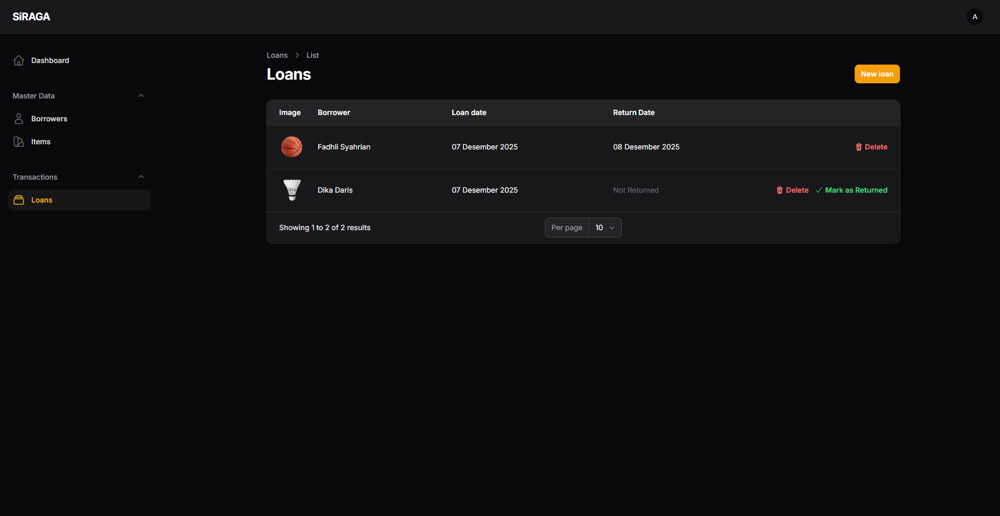

# 🏀 SiRAGA - Sistem Informasi Peminjaman Alat Olahraga
**SiRAGA** (Sistem Informasi Peminjaman Alat Olahraga) adalah aplikasi berbasis web untuk mengelola peminjaman alat olahraga.



---

## 🔧 Fitur Utama

- 👤 Manajemen peminjam
- 🏸 Manajemen alat olahraga
- 🔎 Fitur pencarian & filter
- 🫴🏼 Peminjaman dan pengembalian
- 📱 Desain responsif (mobile-friendly)

---

## 🚀 Instalasi

```bash
git clone https://github.com/fahmirizalbudi/siraga.git
cd siraga
composer install
cp .env.example .env
php artisan key:generate
php artisan migrate
php artisan serve
# buka web browser sesuai port jika (misalnya http://localhost:8080/)
```

---

## ✨ Kontribusi

Pull request terbuka untuk perbaikan bug, dokumentasi, atau fitur tambahan.
